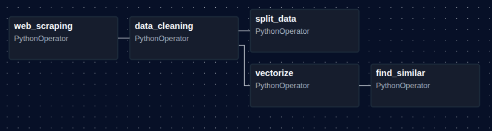

# Projeto Tech Challenge Flask-Streamlit App de Livros

## Como a aplicação funciona?

- Existem dois serviços:
  - Back-end de Flask: [tech-challenge-books-flask-api.onrender.com](https://tech-challenge-books-flask-api.onrender.com)
  - Front-end de Streamlit: [tech-challenge-books-streamlit-api.onrender.com](https://tech-challenge-books-streamlit-api.onrender.com)

- <span style="color:red">IMPORTANTE</span>: Os serviços ficam em modo repouso após um tempo sem utilização, ou seja, ao abrir o front-end e mandar uma requisição, a aplicação pode falhar. <span style="color:red">É necessário garantir que os dois serviços estejam funcionando.</span>
- Ao seguir o link do back-end, o serviço deve apresentar uma tela com o código 404, já estará funcionando.

- <span style="color:green">POSSÍVEL BUG</span>: É possível que após digitar algo em um campo de texto, a página recarregue e o valor desapareça. Acredito que seja um bug do Streamlit que acontece somente na primeira inicialização. Após esse acontecimento, os campos são preenchidos normalmente.

### Arquitetura do Serviço



### Realização do Login

- Ao inserir os dados necessários de usuário e senha, um token será gerado ao clicar no botão de Login.
- Esse token deve ser copiado e colado na aba ```Token``` logo abaixo. **Apenas cole e ele já estará funcionando**, o botão desta aba é somente para gerar outro caso sinta necessidade.


## Como rodar a aplicação pelo Docker?

- [Imagens Docker](https://hub.docker.com/repositories/mathvivas)

- Rodando as imagens pelo terminal
```docker
docker network create books-net

docker run --name flask-api --network books-net -p 5000:5000 mathvivas/tech-challenge-books-flask-api:latest

docker run --name streamlit-ui --network books-net \
  -e API_URL=http://flask-api:5000 \
  -p 8000:8000 mathvivas/tech-challenge-books-streamlit-api:latest
```

## Como rodar a aplicação localmente com o projeto do Github?

- Clonar o repositório
- python -m venv .env
- source .env/bin/activate ou .env\Scripts\activate
- pip install -r requirements.txt
- Rodar o back-end **dentro da pasta app**:
```
gunicorn --bind 0.0.0.0:5000 app:app
```
- Rodar o front-end **dentro da pasta app**:
```
streamlit run streamlit_app.py
```

## Vídeo de demonstração da aplicação

[](https://www.youtube.com/watch?v=PD2pTJ3ie5I)