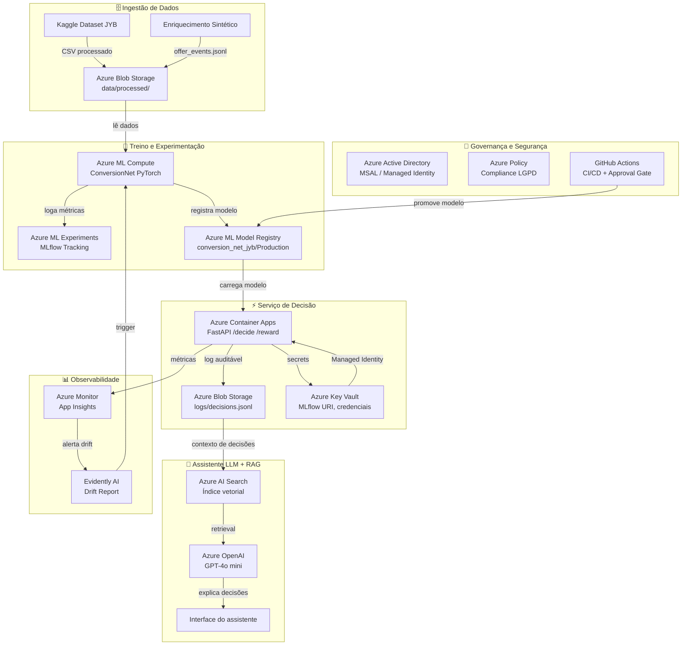

# Arquitetura-Alvo Azure — Datathon 7MLET

> **Versão da política:** v1.0
> **Braços disponíveis:** dep_6m_8pct, dep_12m_10pct, reativacao, cashback, previdencia

## Evidências de qualidade (etapas anteriores)

| Métrica                        | Valor         |
|-------------------------------|---------------|
| Conversão bandit (simulação)  | 0.0% |
| Conversão baseline            | 0.0% |
| Golden set pass rate          | 100%   |

---

## Diagrama de Arquitetura





---

## Mapeamento de Serviços Azure

| Camada                          | Serviço Azure                       | Uso no projeto                                               |
|---------------------------------|-------------------------------------|--------------------------------------------------------------|
| Compute / Treino               | Azure Machine Learning              | Treino do ConversionNet, rastreio MLflow, registro de modelo |
| API / Serviço                  | Azure Container Apps                | Hospeda FastAPI /decide /reward — escala a zero quando sem r |
| Dados                          | Azure Blob Storage                  | Armazena datasets, artefatos de modelo, logs auditáveis, gol |
| IA / RAG                       | Azure AI Search                     | Índice vetorial para RAG do assistente LLM (políticas + expe |
| IA / LLM                       | Azure OpenAI                        | Modelo GPT-4o mini para o assistente que explica decisões do |
| Segredos                       | Azure Key Vault                     | MLflow Tracking URI, connection strings, API keys do Azure O |
| Identidade                     | Managed Identity + Azure AD         | Container Apps acessa Key Vault e Blob sem credenciais explí |
| Observabilidade                | Azure Monitor + Application Insights | Métricas de latência, taxa de erro, alertas de drift de reco |
| CI/CD                          | GitHub Actions                      | Pipeline de treino, testes automatizados, approval gate, dep |
| Governança                     | Azure Policy + Purview              | Compliance LGPD, catalogação de dados sensíveis, retenção de |

---

## Alternativas Descartadas

| Serviço considerado              | Motivo do descarte                                           |
|----------------------------------|--------------------------------------------------------------|
| Azure Machine Learning              | Azure Databricks — custo maior para volume atual             |
| Azure Container Apps                | AKS — overhead operacional desnecessário nesta fase          |
| Azure Blob Storage                  | Azure Data Lake Gen2 — adequado se volume > 1TB              |
| Azure AI Search                     | FAISS local — sem HA e sem integração nativa Azure           |
| Azure OpenAI                        | Claude via API — fora do ecossistema Azure nativo            |
| Azure Key Vault                     | Variáveis de ambiente hardcoded — violação de segurança      |
| Managed Identity + Azure AD         | Service Principal com secret — rotação manual de segredos    |
| Azure Monitor + Application Insights | Prometheus/Grafana self-hosted — maior custo operacional     |
| GitHub Actions                      | Azure DevOps — redundante se repositório já no GitHub        |
| Azure Policy + Purview              | Controles manuais — não escalável e auditável                |

---


## Plano de Gestão de Segredos

### Segredos armazenados no Azure Key Vault

| Nome do segredo           | Usado por                  | Rotação       |
|---------------------------|----------------------------|---------------|
| `mlflow-tracking-uri`     | Container Apps, GitHub CI  | 90 dias       |
| `azure-openai-api-key`    | Assistente LLM             | 30 dias       |
| `blob-storage-conn-str`   | Pipeline de treino         | 90 dias       |
| `ai-search-api-key`       | RAG do assistente          | 90 dias       |

### Fluxo de acesso sem credenciais hardcoded

```
Container Apps
  └── System-assigned Managed Identity
        └── Key Vault Access Policy (Get, List)
              └── segredo: mlflow-tracking-uri
```

### Configuração no Container Apps

```bash
# Adiciona segredo referenciando Key Vault (sem copiar o valor)
az containerapp secret set \
  --name bandit-api \
  --resource-group $RG \
  --secrets mlflow-uri=keyvaultref:$KV_NAME/mlflow-tracking-uri

# Passa como variável de ambiente
az containerapp update \
  --name bandit-api \
  --set-env-vars MLFLOW_TRACKING_URI=secretref:mlflow-uri
```

### Regra: nenhuma credencial no código ou no .env commitado

O `.env.example` lista apenas os **nomes** das variáveis, nunca os valores:
```
MLFLOW_TRACKING_URI=
AZURE_OPENAI_API_KEY=
AZURE_BLOB_CONN_STR=
AI_SEARCH_API_KEY=
```


---

## Plano de Deploy

```bash
# 1. Criar Resource Group
az group create --name rg-datathon-7mlet --location eastus2

# 2. Criar Azure ML Workspace
az ml workspace create \
  --name aml-datathon \
  --resource-group rg-datathon-7mlet

# 3. Build e push da imagem
az acr build \
  --registry $ACR_NAME \
  --image bandit-api:${GITHUB_SHA} .

# 4. Deploy no Container Apps
az containerapp create \
  --name bandit-api \
  --resource-group rg-datathon-7mlet \
  --image $ACR_NAME.azurecr.io/bandit-api:${GITHUB_SHA} \
  --target-port 8000 \
  --ingress external \
  --min-replicas 0 \
  --max-replicas 10

# 5. Configurar Managed Identity
az containerapp identity assign \
  --name bandit-api \
  --resource-group rg-datathon-7mlet \
  --system-assigned

# 6. Dar acesso ao Key Vault
az keyvault set-policy \
  --name $KV_NAME \
  --object-id $(az containerapp identity show \
    --name bandit-api --resource-group rg-datathon-7mlet \
    --query principalId -o tsv) \
  --secret-permissions get list
```

---


## Estimativa de Custo (FinOps)

> Estimativa qualitativa para carga de demonstração (Demo Day).
> Valores em USD/mês aproximados para região East US 2.

| Serviço                  | SKU / Uso estimado              | Custo mensal aprox. |
|--------------------------|---------------------------------|---------------------|
| Azure ML Compute         | DS3_v2 × 10h treino/mês         | ~$5                 |
| Azure Container Apps     | ~10k req/mês, scale-to-zero     | ~$2                 |
| Azure Blob Storage       | 10GB dados + logs               | ~$0.20              |
| Azure AI Search          | Basic, 1 índice                 | ~$75                |
| Azure OpenAI             | gpt-4o-mini, ~100k tokens/mês   | ~$0.15              |
| Azure Key Vault          | Standard, <10k operações/mês    | ~$0.05              |
| Azure Monitor            | <5GB logs/mês (tier gratuito)   | ~$0                 |
| GitHub Actions           | <2.000 min/mês (tier gratuito)  | ~$0                 |
| **Total estimado**       |                                 | **~$83/mês**        |

### TCO (Total Cost of Ownership) — Produção real

Em produção regulada com SLA 99.9%, escala para ~10k req/dia:
- Container Apps: ~$50/mês (réplicas mínimas + tráfego)
- Azure ML: ~$200/mês (retreino semanal automatizado)
- AI Search: ~$250/mês (Standard S1 para latência garantida)
- **Estimativa produção**: ~$600–800/mês

### Cenários de escala

| Volume req/dia | Componente crítico         | Ação recomendada                |
|----------------|----------------------------|---------------------------------|
| < 1k           | Container Apps scale-zero  | Consumption plan atual          |
| 1k – 50k       | Container Apps CPU         | Aumentar réplicas mínimas → 2   |
| 50k – 500k     | Blob Storage latência      | Migrar logs para Event Hub      |
| > 500k         | AI Search                  | Standard S2 + réplicas          |

### Redução de custo

- **Desligar ML Compute** fora de janelas de retreino (economia ~70%)
- **Scale-to-zero** no Container Apps em horários fora do pico
- **Tier Cool** no Blob para logs com mais de 30 dias

