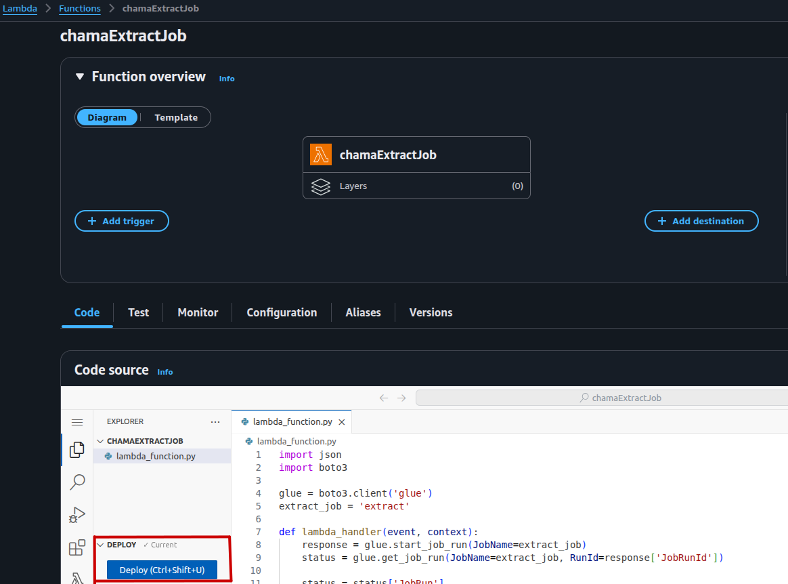
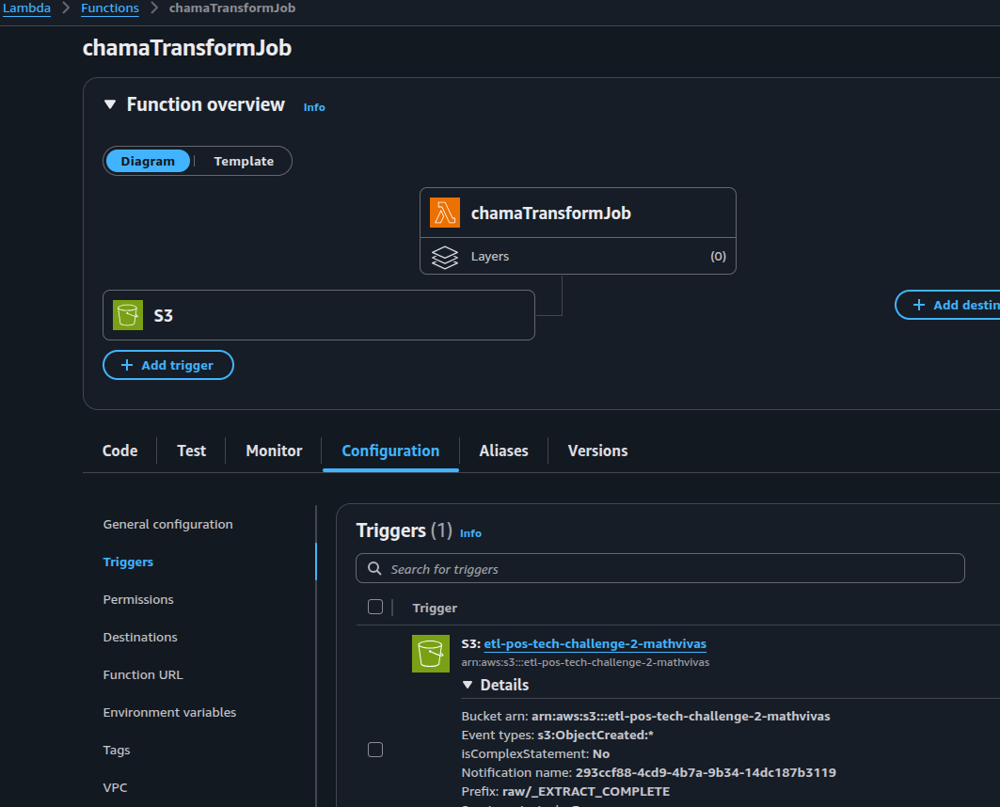
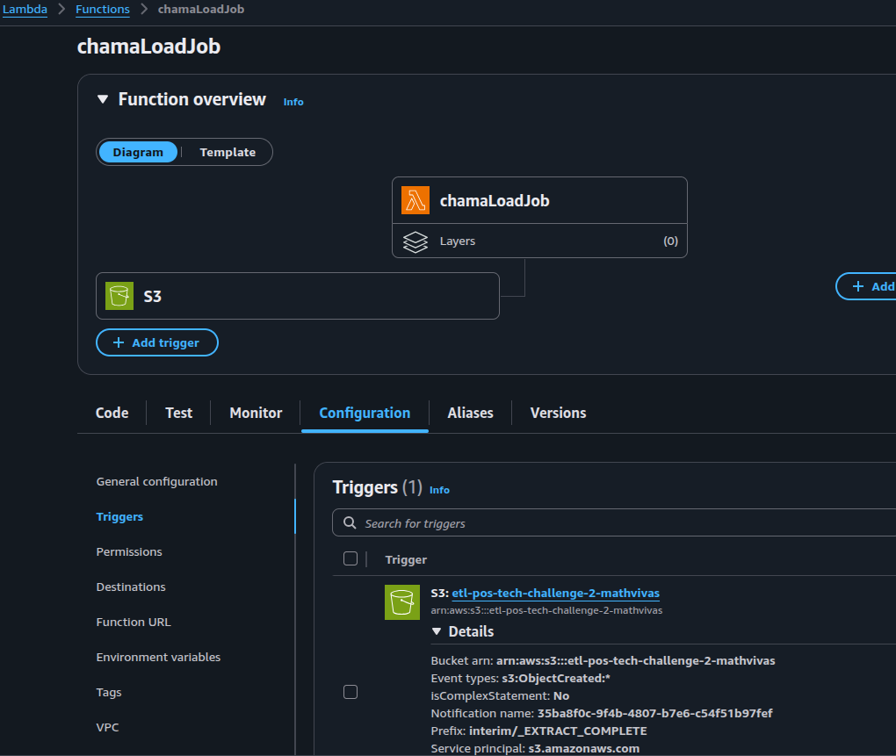
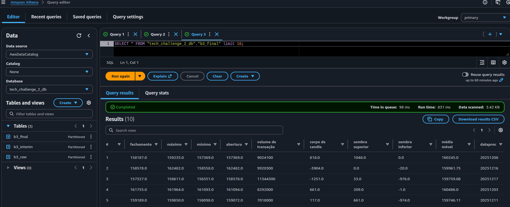

# Tech Challenge 2 - ETL AWS

## Procedimento

- EventBridge/Scheduler chama a Lambda do Extract.
- A Lambda do Extraction chama o Job do Extract.
- O Job do Extract executa o script e insere os dados na pasta raw/.
- Após todos os dados serem inseridos, é criado um arquivo "_EXTRACT_COMPLETE". Seu papel é mostrar que a execução foi concluída.
- O Job do Transform está com uma trigger no raw/_EXTRACT_COMPLETE, ou seja, após sua criação, o Job executa e também cria esse arquivo na pasta interim/ quando for concluído.
- O Job do Load está com uma trigger no interim/_EXTRACT_COMPLETE.

## S3

## Glue

## Lambda

**NÃO ESQUECER DE FAZER O DEPLOY DO CÓDIGO**

## Athena

## Vídeo de demonstração da aplicação

